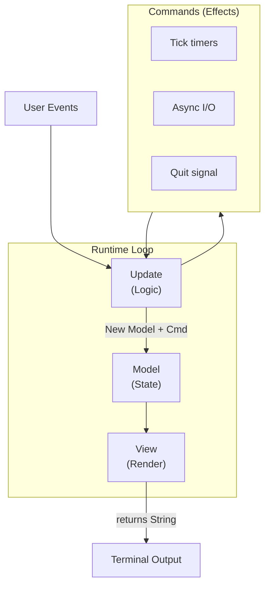

# Ferment

A Rust-native terminal UI framework inspired by [Bubble Tea](https://github.com/charmbracelet/bubbletea).

## Overview

`ferment` provides a functional, declarative approach to building terminal user interfaces:

- **Model-Update-View** - Core architecture based on The Elm Architecture
- **Composable Components** - Reusable widgets like spinners, inputs, and selectors
- **Form System** - Declarative form building with validation
- **CI-Friendly** - Automatic non-interactive mode detection

## Quick Start

```rust
use ferment::{Model, Program, Cmd, Event, KeyCode};

struct Counter {
    count: i32,
}

enum Msg {
    Increment,
    Decrement,
    Quit,
}

impl Model for Counter {
    type Message = Msg;

    fn init(&self) -> Option<Cmd<Self::Message>> {
        None
    }

    fn update(&mut self, msg: Self::Message) -> Option<Cmd<Self::Message>> {
        match msg {
            Msg::Increment => self.count += 1,
            Msg::Decrement => self.count -= 1,
            Msg::Quit => return Some(Cmd::quit()),
        }
        None
    }

    fn view(&self) -> String {
        format!("Count: {}\n\nPress +/- to change, q to quit", self.count)
    }

    fn handle_event(&self, event: Event) -> Option<Self::Message> {
        match event {
            Event::Key(key) => match key.code {
                KeyCode::Char('+') => Some(Msg::Increment),
                KeyCode::Char('-') => Some(Msg::Decrement),
                KeyCode::Char('q') => Some(Msg::Quit),
                _ => None,
            },
            _ => None,
        }
    }
}

fn main() -> Result<(), Box<dyn std::error::Error>> {
    Program::new(Counter { count: 0 }).run()?;
    Ok(())
}
```

## Components

### Spinner

```rust
use ferment::components::{Spinner, SpinnerStyle};

let spinner = Spinner::new()
    .style(SpinnerStyle::Dots)
    .message("Loading...");
```

### Progress Bar

```rust
use ferment::components::Progress;

let progress = Progress::new()
    .total(100)
    .current(45)
    .message("Downloading...");
```

### Text Input

```rust
use ferment::components::TextInput;

let input = TextInput::new()
    .placeholder("Enter your name...")
    .prompt("> ");
```

### Select

```rust
use ferment::components::Select;

let select = Select::new("Choose a color")
    .options(vec!["Red", "Green", "Blue"]);
```

### Confirm

```rust
use ferment::components::Confirm;

let confirm = Confirm::new("Are you sure?")
    .default(false);
```

### MultiSelect

```rust
use ferment::components::MultiSelect;

let select = MultiSelect::new("Choose colors")
    .options(vec!["Red", "Green", "Blue"])
    .min(1)
    .max(2);
```

### Text Area

```rust
use ferment::components::TextArea;

let textarea = TextArea::new()
    .placeholder("Enter your message...")
    .height(10)
    .width(60);
```

### Viewport

```rust
use ferment::components::Viewport;

let viewport = Viewport::new(80, 20)
    .content("Long scrollable content here...");
```

### List

```rust
use ferment::components::List;

let list = List::new("Select a file")
    .items(vec!["main.rs", "lib.rs", "Cargo.toml"])
    .height(10)
    .filterable(true);
```

### Table

```rust
use ferment::components::{Table, Column};

let table = Table::new()
    .columns(vec![
        Column::new("Name").width(20),
        Column::new("Age").width(5),
        Column::new("City").width(15),
    ])
    .rows(vec![
        vec!["Alice", "30", "New York"],
        vec!["Bob", "25", "Los Angeles"],
    ])
    .height(10);
```

### MultiProgress

```rust
use ferment::components::MultiProgress;

let mp = MultiProgress::new()
    .add_task("download", "Downloading files...", 100)
    .add_task("compile", "Compiling...", 50)
    .add_task("test", "Running tests...", 200);
```

## Forms

Build multi-step forms with validation:

```rust
use ferment::forms::{Form, Group, InputField, SelectField, ConfirmField};

let form = Form::new()
    .title("User Registration")
    .group(
        Group::new()
            .title("Personal Info")
            .field(InputField::new("name").title("Your name").required().build())
            .field(InputField::new("email").title("Email").build())
    )
    .group(
        Group::new()
            .title("Preferences")
            .field(SelectField::new("theme").title("Theme")
                .options(["Light", "Dark", "System"]).build())
            .field(ConfirmField::new("newsletter").title("Subscribe?").build())
    );
```

## Styling

```rust
use ferment::style::{Style, Color};

let styled = Style::new()
    .fg(Color::Cyan)
    .bold()
    .render("Hello, World!");
```

## Architecture

The framework follows The Elm Architecture:

1. **Model** - Your application state (any Rust struct)
2. **Message** - Events that trigger state changes
3. **Update** - Pure function that handles messages and updates state
4. **View** - Pure function that renders state as a string
5. **Commands** - Side effects (timers, async operations)



## CI/Script Compatibility

The framework automatically detects non-interactive environments:

- No animations or spinners
- Clear error messages
- Appropriate exit codes
- Works with piped input/output

## Accessibility

Ferment supports accessible mode for screen reader users and other assistive technologies.

### Enabling Accessible Mode

Set the `ACCESSIBLE` environment variable:

```bash
ACCESSIBLE=1 ./my-app
```

### What Changes in Accessible Mode

- **Plain text output** - No ANSI escape codes or visual formatting
- **Numbered options** - Selection components use numbers instead of arrow navigation
- **Line-based input** - Standard stdin reading instead of raw terminal mode
- **Clear prompts** - Screen reader-friendly text descriptions

### Accessible Forms

Use `Form::run_accessible()` for a fully accessible form experience:

```rust
use ferment::forms::{Form, Group, InputField, SelectField, ConfirmField};

let mut form = Form::new()
    .title("User Survey")
    .group(
        Group::new()
            .field(InputField::new("name").title("Your name").build())
            .field(SelectField::new("color").title("Favorite color")
                .options(["Red", "Green", "Blue"]).build())
            .field(ConfirmField::new("subscribe").title("Subscribe to newsletter?").build())
    );

// Run in accessible mode (line-based prompts)
match form.run_accessible() {
    Ok(Some(results)) => {
        println!("Name: {}", results.get_string("name").unwrap_or(""));
        println!("Color: {}", results.get_string("color").unwrap_or(""));
        println!("Subscribe: {}", results.get_bool("subscribe").unwrap_or(false));
    }
    Ok(None) => println!("Form cancelled"),
    Err(e) => eprintln!("Error: {}", e),
}
```

### Example Accessible Session

```
=== User Survey ===

Your name
?
> Alice

Favorite color
? Favorite color
  1) Red
  2) Green
* 3) Blue
Enter number (or q to cancel): 3

Subscribe to newsletter?
? Subscribe to newsletter? (y/N) y

Form completed!
```

### Custom Accessible Components

Components can implement the `Accessible` trait for custom accessible rendering:

```rust
use ferment::{Accessible, Model};

impl Accessible for MyComponent {
    type Message = MyMsg;

    fn accessible_prompt(&self) -> String {
        // Return plain text prompt
        format!("? {}\n> ", self.title)
    }

    fn parse_accessible_input(&self, input: &str) -> Option<Self::Message> {
        // Parse line input and return message
        Some(MyMsg::SetValue(input.trim().to_string()))
    }

    fn is_accessible_complete(&self) -> bool {
        self.submitted
    }
}
```

### Environment Variables

| Variable          | Description                              |
| ----------------- | ---------------------------------------- |
| `ACCESSIBLE=1`    | Enable accessible mode                   |
| `NO_COLOR=1`      | Disable colors (respected automatically) |
| `REDUCE_MOTION=1` | Disable animations                       |

## License

[Apache-2.0](LICENSE)
